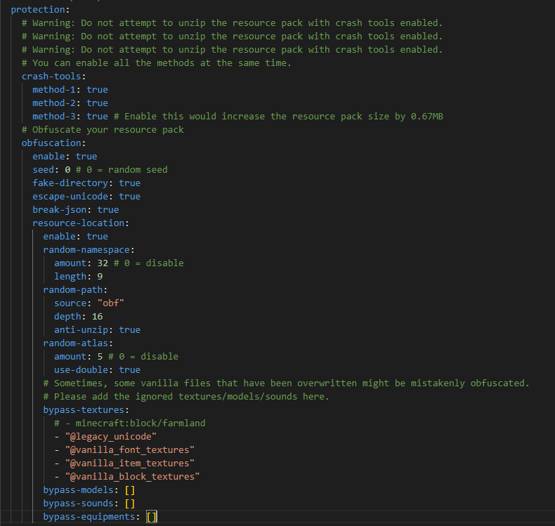

# 资源包框架

import Tabs from '@theme/Tabs';
import TabItem from '@theme/TabItem';

<Tabs queryString="ff">
<TabItem value="ia" label="ItemsAdder">

:::info

`SpigotMC` https://www.spigotmc.org/resources/.73355/

`GitHub(主页)` https://github.com/ItemsAdder

`GitHub(可以反馈BUG)` https://github.com/PluginBugs/Issues-ItemsAdder

`文档(英文)` https://itemsadder.devs.beer/

`文档(中文)` https://itemsadder.devs.beer/v/chinese

`文档(非官方中文)` https://docs.superiormc.cn/v/itemsadder-doc

:::

这是一个付费闭源插件，GitHub上并没有上传插件本体。

```text
【IA入门指南.新手必看.简洁版】
-
第一步：IA是基于原版的材质包框架所开发的插件，所以遵守Mojang制定的材质包规范， 如果你会材质包开发甚至不需要用到IA。如果你在使用IA时连CMD，命名空间，着色器，JSON这些最基本的内容都不知道请恶补以下内容：
https://zhangshenxing.github.io/VanillaModTutorial
-
第二步：
使用IA官方WIKI并结合原版材质包开发产出内容，但是请注意IA内有大量无用功能和屎山代码，所以将IA当作一个打包器是最优解的选择
https://itemsadder.devs.beer
-
第三步：如何让你的服务器更加劣质的办法(仅我个人而言，如果你看的很不舒服我很抱歉，如果你要对号入座那就是你是对的)
1. 大量声明空间引用乱的一批，这类服务器要不就是腐竹技术过低，要不就是海鲜缝合包或盗用，连国外9美刀的付费端都不如
2. 材质混素严重，在16px-128px漂浮不定，没有自己的主美体系
3. 乱加插件，看啥加啥，导致服务器变成性能答辩，这种服开不了几个月就跑路
4. 在高版本非特殊需求还在使用单端开发，没有采用最基本的群组框架

                                    ————来自ia群 群公告
```

连基础都没学不要他妈的问问问

</TabItem>
<TabItem value="orx" label="Oraxen">

:::info

`SpigotMC` https://www.spigotmc.org/resources/.72448

`GitHub` https://github.com/oraxen/oraxen

`文档(英文)` https://docs.oraxen.com/

`文档(中文)` https://snowcutieowo.github.io/Oraxen/README.html

:::

和 ItemsAdder 同类型的插件，付费开源，不想花钱可以自己构建。

如果你没有能力手搓出你想要的东西(如对资源包非常了解，能自己写代码补Oraxen没有的功能)那就去花钱用旁边的 ItemsAdder

还找到另一个中文文档 https://3504743864.gitbook.io/oraxen-wiki

</TabItem>

<TabItem value="ce" label="CraftEngine">

:::info

`GitHu(部分开源)` https://github.com/Xiao-MoMi/craft-engine

`文档(英文)` https://mo-mi.gitbook.io/xiaomomi-plugins

`文档(中文)` https://momi.gtemc.cn

:::

CraftEngine 是一款专为 Minecraft 服务器设计的插件 + 服务端mod,
旨在通过配置文件动态创建自定义方块、物品和配方，
从而实现高度灵活的自定义内容扩展。

该插件基于 Paper/Folia 服务器核心开发，支持 1.20.1 及以上版本，并通过 JVM 级注入技术提供卓越的性能、稳定性和扩展性。

## 插件特点
### 更安全的资源包保护

:::danger
不要尝试解压开启了 crash-tools 的的资源包！
:::

:::warning
这个保护并不是100%的防御，
你可能需要[《中华人民共和国著作权法》](https://www.gov.cn/guoqing/2021-10/29/content_5647633.htm) 的保护！

如果发现有可以破解资源包的工具可以向本插件的 [Discord](https://discord.gg/WVKdaUPR3S) 频道提交问题！
:::

CraftEngine 提供了比 PackSquash 更强大的内置资源包保护



推荐配置：

```yaml
protection:
  crash-tools:
    method-1: true
    method-2: true
    method-3: true
  obfuscation:
    enable: true
    seed: 0
    fake-directory: true
    escape-unicode: true
    break-json: true
    resource-location:
      enable: true
      random-namespace:
        amount: 64
        length: 9
      random-path:
        source: "obf"
        depth: 32
        anti-unzip: true
      random-atlas:
        amount: 5
        use-double: true
      bypass-textures:
        - "@legacy_unicode"
        - "@vanilla_font_textures"
        - "@vanilla_item_textures"
        - "@vanilla_block_textures"
      bypass-models: []
      bypass-sounds: []
      bypass-equipments: []
```

</TabItem>

<TabItem value="nexo" label="Nexo">

:::info

`Polymart` https://polymart.org/resource/nexo.6901

:::

Oraxen 翻版,目前不推荐使用,英文文档都被删除了

</TabItem>
<TabItem value="Crucible" label="Crucible">

:::info

`MythicCraft` https://mythiccraft.io/index.php?resources/2

`文档(英文)` https://git.mythiccraft.io/mythiccraft/mythiccrucible

`文档(中文)` https://gitlab.com/TranslatedByShark/MythicCrucible-Manual-CN/-/wikis/home

:::

较为小众的资源包框架，不推荐使用

</TabItem>
</Tabs>