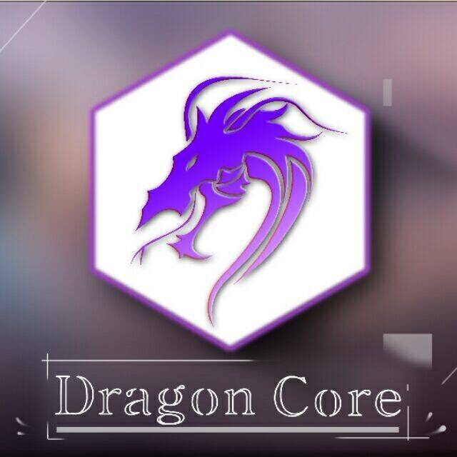

# 龙之核心

## 

龙之核心是基于 Minecraft 1.12.2 版本，以插件(服务端) + MOD(客户端) 的方式，
实现了丰富的在服务端制作各种客户端功能的方法。

与 [萌芽引擎](Germ_Engine.md) 为同类型插件

## 链接

:::info

`文档` https://arisa.gitbook.io/internal-wiki

:::

旧官方文档：https://core.anxidc.com

q1 的文档：https://q1c.gitbook.io/dragoncore-course
